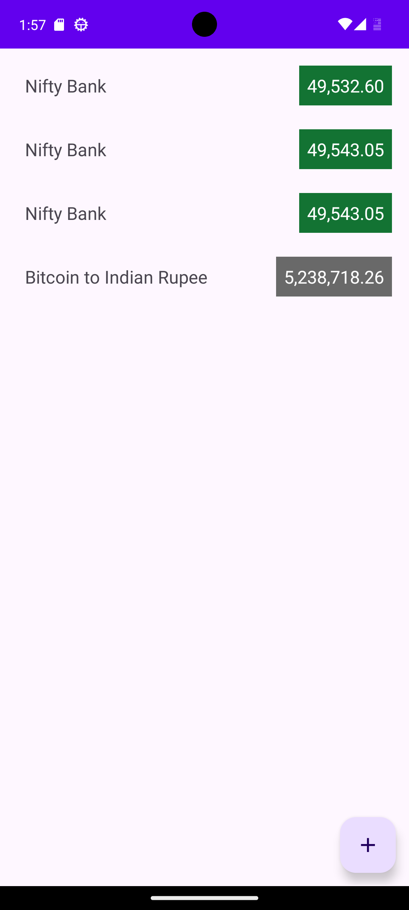
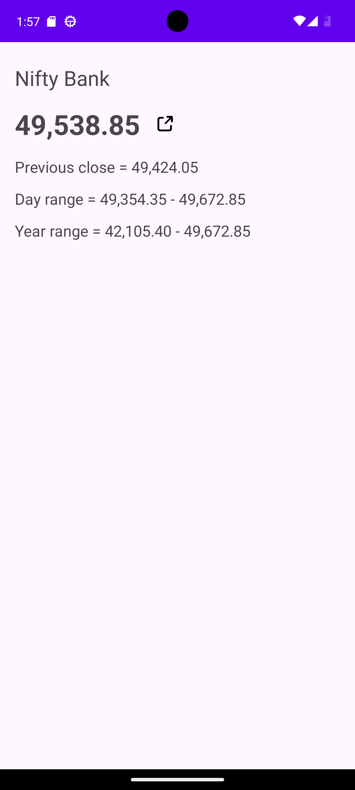
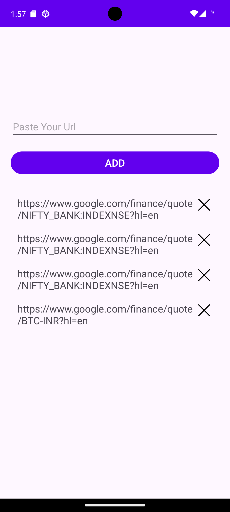

# StockMonitor

StockMonitor is an application that scrapes stock data from Google Finance website and provides real-time updates every 5 seconds using Kotlin Flow.

## Features

- **Web Scraping**: Utilizes web scraping techniques to fetch stock data from Google Finance.
- **Real-time Updates**: Stock data is refreshed automatically every 5 seconds using Kotlin Flow.
- **Customizable**: Easily configurable to monitor specific stocks of interest by adding them using their Google Finance URLs.

## Installation

1. Clone the repository:

    ```bash
    git clone https://github.com/yourusername/stockmonitor.git
    ```

2. Open the project in Android Studio.

3. Build and run the project on your device or emulator.

## Usage

1. Launch the StockMonitor app on your device.
2. Add stocks using their Google Finance URLs.
3. View real-time updates of the stock data.
4. Customize the app settings as needed.

## Adding Stocks

To add a stock to monitor, follow these steps:

1. Navigate to Google Finance in your web browser.
2. Search for the stock you want to monitor.
3. Copy the URL of the stock from the browser's address bar.
4. Paste the URL into the StockMonitor app.
5. Save the changes.

## Screenshots





## Technologies Used

- Kotlin
- Kotlin Flow
- Jsoup (for web scraping)
- Android Jetpack Components

## Contributing

Contributions are welcome! If you have any ideas, suggestions, or bug fixes, feel free to open an issue or create a pull request.

## License

This project is licensed under the [MIT License](LICENSE).
